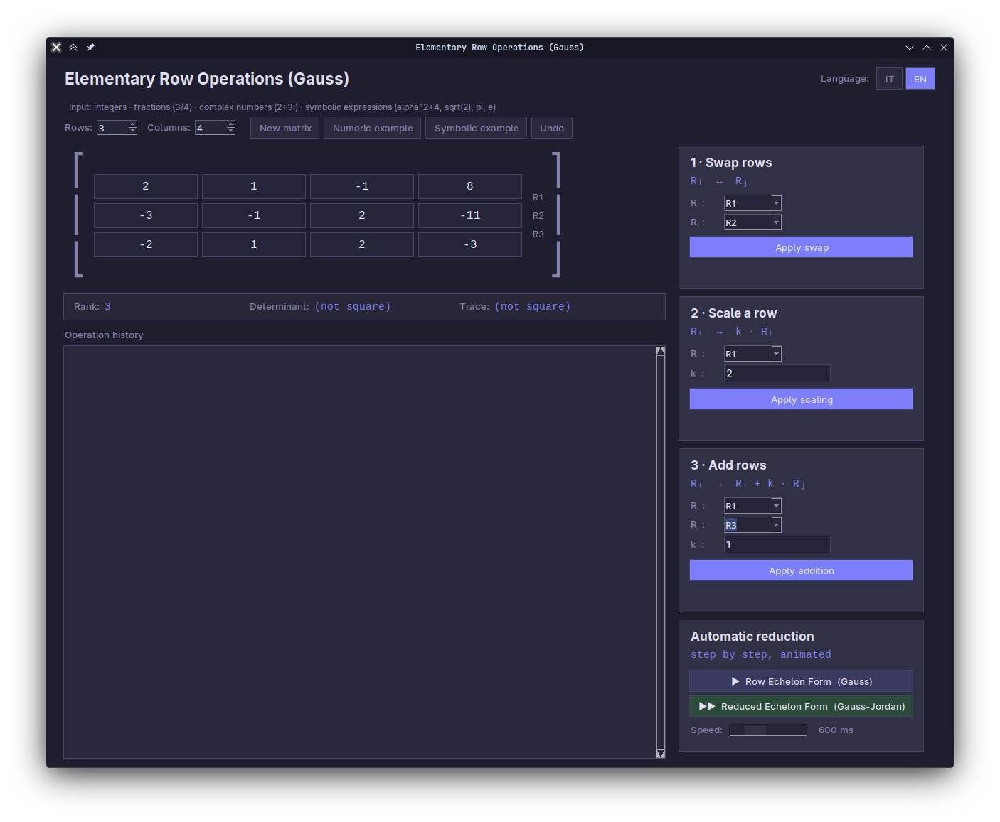

# Elementary Row Operations (Gauss) — Matrix GUI

A desktop app written in Python/tkinter for performing **elementary row operations** on matrices, step by step. It handles integers, fractions, complex numbers and symbolic expressions (thanks to [SymPy](https://www.sympy.org/)), and can reduce a matrix to row echelon form (Gauss) or reduced row echelon form (Gauss-Jordan) with an animated, step-by-step display.

> The interface is available in **Italian and English**. Switch language at any time with the **IT / EN** buttons at the top right (default: Italian).

## Screenshots



## Known issues

- Tkinter does not provide a native way to scroll, hence you will need to expand the window to access all the buttons.

## Features

- **Three manual row operations**
  - Swap: `Rᵢ ↔ Rⱼ`
  - Scale: `Rᵢ → k · Rᵢ` (k ≠ 0)
  - Add: `Rᵢ → Rᵢ + k · Rⱼ` (k ≠ 0)
- **Automatic reduction**, animated one step at a time
  - Row echelon form (Gauss)
  - Reduced row echelon form (Gauss-Jordan)
  - Adjustable animation speed (100–2000 ms per step)
- **Info panel** that updates live: rank, determinant and trace (determinant and trace only for square matrices)
- **Bilingual interface (IT / EN)**: switch on the fly; your matrix, history and settings are kept
- **Exact arithmetic**: no floating-point rounding for integers, fractions and symbolic values
- **Operation history** with a log of every step and an **Undo** button
- **Row highlighting**: the row being modified is shown in blue, the reference row in green
- **Built-in examples**: one numeric and one symbolic
- Matrix size from **1×1 up to 8 rows × 10 columns**, editable at any time

## Requirements

- Python 3.8+
- [SymPy](https://pypi.org/project/sympy/)
- tkinter (included with most Python installers)

```bash
pip install sympy
```

On some Linux distributions tkinter is packaged separately:

```bash
sudo apt install python3-tk
```

## Usage

```bash
python matrici_operazioni_gauss.py
```

The app opens with a 3×4 numeric example loaded (an augmented matrix for a 3-variable linear system).

### Editing the matrix

Click any cell and type a value. Change the matrix size with the **Righe** / **Rows** and **Colonne** / **Columns** spinboxes; existing values are kept and new cells are filled with 0.

### Accepted input

| Type | Examples |
|---|---|
| Integers | `3`, `-7` |
| Fractions | `-1/2`, `3/4` |
| Decimals | `0.5` or `0,5` (comma is accepted) |
| Complex numbers | `2+3i`, `i`, `-4i` (`j` also works) |
| Symbolic expressions | `alfa^2+4`, `a`, `2*x+1` |
| Constants and functions | `pi`, `e`, `sqrt(2)` |

Notes:

- `^` is accepted as the power operator.
- `i`, `j` and `I` are the imaginary unit, and `e` is Euler's number, so these letters can't be used as variable names.
- Any other name (such as `a` or `alfa`) is treated as a symbolic parameter.
- Invalid input in a cell shows an error message that names the offending cell.

### Buttons

| Button (IT / EN) | Action |
|---|---|
| **Nuova matrice** / **New matrix** | Resets the matrix to zeros with the chosen size and clears the history |
| **Esempio numerico** / **Numeric example** | Loads a 3×4 integer example |
| **Esempio simbolico** / **Symbolic example** | Loads a 3×4 example containing a parameter `a` |
| **Annulla** / **Undo** | Undoes the last operation |

### Manual operations (right-hand panel)

Pick the row(s) from the drop-downs, enter `k` where needed, and press the button. The matrix and history update immediately. Manual edits to cells are read before every operation, so you can freely mix typing and operations.

### Automatic reduction

- **Forma a Scala (Gauss)** / *Row Echelon Form* reduces the matrix to row echelon form. Pivots are normalized to 1, and entries below each pivot are eliminated.
- **Forma Ridotta (Gauss-Jordan)** / *Reduced Echelon Form* goes further and eliminates the entries above each pivot as well, giving the reduced row echelon form.

Use the **Velocità** / **Speed** slider to control the delay between steps. If the matrix is already in the target form, a message says so.

## Notes and limitations

- **Symbolic pivots are assumed non-zero.** With symbolic entries, the automatic algorithms treat any expression that doesn't simplify to 0 as a valid pivot. They do not split into cases (for example, "if `a = 0`" vs "if `a ≠ 0`"), so results with parameters hold for generic values of the parameter.
- Undoing after an automatic reduction restores the matrix to how it was before the reduction started.
- The app uses the *Segoe UI* and *Courier New* fonts; on systems without them, tkinter falls back to default fonts and spacing may look slightly different.

## Project structure

The whole app is a single file:

| Part | Description |
|---|---|
| `STRINGS`, `tr` | Italian and English UI texts and the lookup function; add a new language by adding a dictionary here |
| `parse_expr`, `fmt` | Convert user input to SymPy expressions and format results for display |
| `gauss_steps` | Generates the steps for row echelon form |
| `gauss_jordan_steps` | Generates the steps for reduced row echelon form |
| `GaussApp` | The tkinter application (UI, manual operations, animation, history, language switch) |
